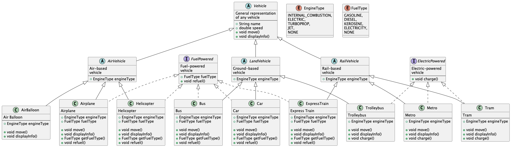

# Транспортная система

## Описание проекта

Проект представляет собой иерархию классов, описывающую различные виды транспортных средств. Пользователь может выбрать
разные транспортные средства, такие как автомобиль, самолёт, троллейбус, воздушный шар и т.д., и исследовать их
свойства.

## Требования

- Java 8 и выше
- Среда IDE для разработки (например, IntelliJ IDEA)

## Установка и запуск

1. Клонируйте репозиторий.
2. Запустите проект через вашу IDE или скомпилируйте и запустите `Main.java` в командной строке.
3. Следуйте инструкциям для выбора транспортного средства.

## Основные классы

- **Vehicle** - Абстрактный базовый класс для всех транспортных средств.
- **AirVehicle**, **RailVehicle** и **LandVehicle** - Классы, представляющие воздушный, железнодорожный и наземный
  транспорт.
- **Car**, **Airplane**, **Trolleybus**, **AirBalloon** и пр. - Конкретные классы для видов транспорта.
- **FuelPowered** и **ElectricPowered** - Интерфейсы для транспортных средств с разными типами двигателей.
- **EngineType** - перечисление для определения типа двигателя.
- **FuelType** - перечисление для определения типа топлива.
- **Main** - Точка входа в программу.

## UML Диаграмма

